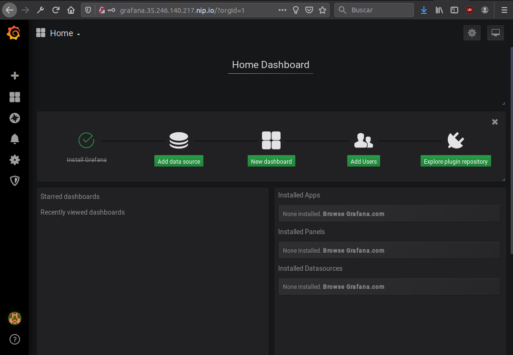
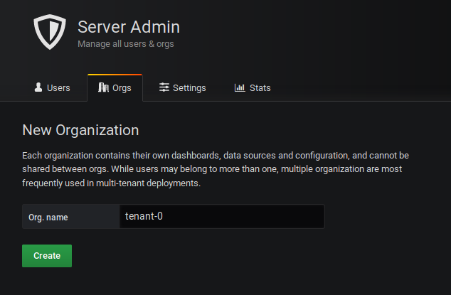
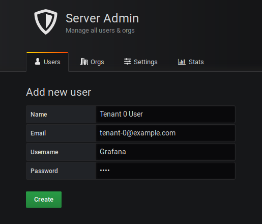
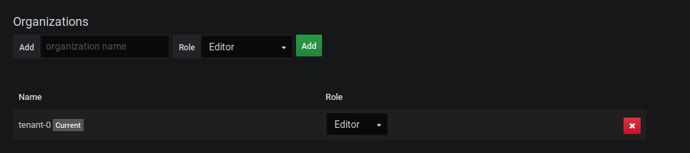
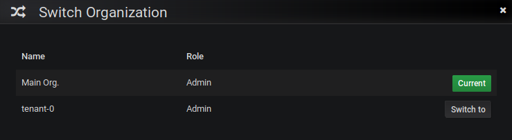
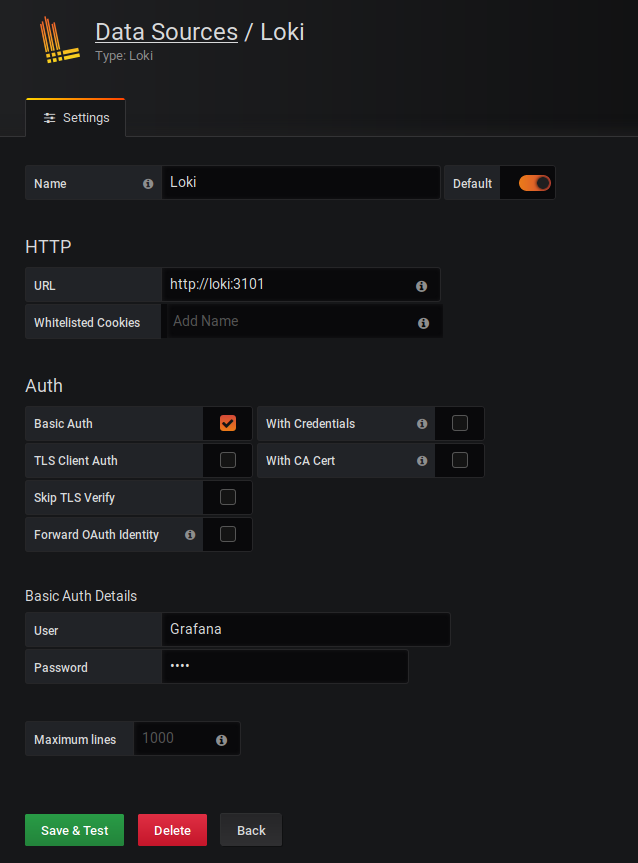
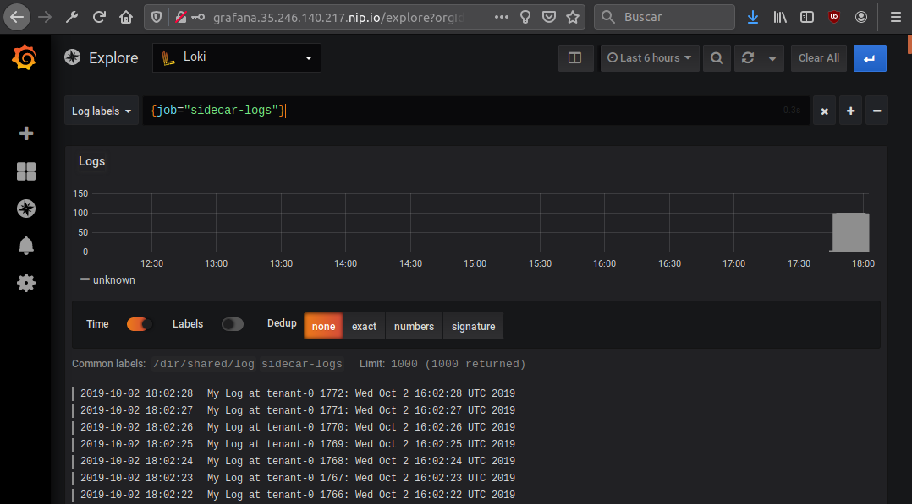

# POC: Multi tenant Grafana Loki Server

## Requirements

It's needed to have a Kubernetes cluster *(k3s inside)* with an ingress controller installed and the helm's tiller deployed.
This POC starts with a `kubectl` client configured.

## Scope

This POC demonstrate how to use Grafana, Grafana loki and Promtail to push logs from a multi-tenant Kubernetes cluster having no access to the underlay host. *Example use case: `pod sandboxes`*.

## Out of scope

- `NetworkPolicies` isolating *tenants/namespaces*: Consider deploy each pod in a separate namespace. The loki server has to be in another namespace. Just open connectivity between pods with promtail to the Grafana Loki server (Proxy).
- `promtail auto-inject`: As this POC demonstrate how to run promtail as sidecar container to push logs to a multi-tenant loki server, would be interesting to have a mechanism to auto inject the sidecar once a pod label is present. Something similar to: [k8s-sidecar-injector](https://github.com/tumblr/k8s-sidecar-injector).

### Start

#### Configure users/tenants for Grafana Loki server

In this example, you can see the following file: [authn.yaml](authn.yaml)

```yaml
users:
  - username: Grafana
    password: L0k1
    orgid: tenant-0
  - username: Tenant1
    password: 1tnaneT
    orgid: tenant-1
```

This file is required by the [`loki-multi-tenant-proxy`](https://github.com/k8spin/loki-multi-tenant-proxy). This will be used by the proxy to forward requests to the grafana loki server authenticating every request and injecting the required loki server headers.

Create the secret in kubernetes:

```bash
$ kubectl create secret generic loki-multi-tenant-proxy-auth-config --from-file=authn.yaml=authn.yaml --dry-run -o yaml | kubectl apply -f -
secret/loki-multi-tenant-proxy-auth-config created
```

#### Deploy Grafana

This POC modifies the default [values.yaml](https://raw.githubusercontent.com/helm/charts/master/stable/grafana/values.yaml) file to create an ingress object using the awesome [`nip.io`](https://nip.io/) service. The rest configuration properties has the default values to make it simple.

```bash
$ helm upgrade --install loki-grafana --values grafana.values.yaml stable/grafana
# Truncated output
NOTES:
1. Get your 'admin' user password by running:

   kubectl get secret --namespace default loki-grafana -o jsonpath="{.data.admin-password}" | base64 --decode ; echo

2. The Grafana server can be accessed via port 80 on the following DNS name from within your cluster:

   loki-grafana.default.svc.cluster.local

   From outside the cluster, the server URL(s) are:
     http://grafana.35.246.140.217.nip.io


3. Login with the password from step 1 and the username: admin
# Truncated output
```

You can get the admin password with the following command:

```bash
$ kubectl get secret --namespace default loki-grafana -o jsonpath="{.data.admin-password}" | base64 --decode ; echo
oD2a5r-----TRUNCATED-----8tEY2jd
```

Access from outside the cluster, the server URL(s) are: [http://grafana.35.246.140.217.nip.io](http://grafana.35.246.140.217.nip.io).



#### Deploy Grafana Loki

This POC uses the pull request [#909](https://github.com/grafana/loki/pull/909) to add a sidecar container to the Grafana Loki Server. This sidecar adds multi-tenant authorization to the Grafana Loki Server.

The default [values.yaml](https://raw.githubusercontent.com/grafana/loki/master/production/helm/loki/values.yaml) file has been modified to add the [grafana-loki-multitenant-proxy](https://github.com/k8spin/loki-multi-tenant-proxy) sidecar container and activated the `auth_enabled: true` configuration property.

*Partial [loki.values.yaml](loki.values.yaml):*

```yaml
config:
  auth_enabled: true

extraContainers: 
## Additional containers to be added to the loki pod.
- name: loki-multi-tenant-proxy
  image: angelbarrera92/loki-multi-tenant-proxy:dev
  args:
    - "run"
    - "--port=3101"
    - "--loki-server=http://localhost:3100"
    - "--auth-config=/etc/loki-multi-tenant-proxy/authn.yaml"
  ports:
    - name: http
      containerPort: 3101
      protocol: TCP
  volumeMounts:
    - name: loki-multi-tenant-proxy-auth-config
      mountPath: /etc/loki-multi-tenant-proxy

extraVolumes:
# Additional volumes to the loki pod.
- name: loki-multi-tenant-proxy-auth-config
  secret:
    secretName: loki-multi-tenant-proxy-auth-config

extraPorts:
# Additional ports to the loki services. Useful to expose extra container ports.
- port: 3101
  protocol: TCP
  name: http
  targetPort: http
```

```bash
$ helm upgrade --install loki --values loki.values.yaml loki/loki
$ # Check there are two containers *(loki server and the proxy)* in the loki-0 pod.
$ kubectl get pods loki-0
NAME     READY   STATUS    RESTARTS   AGE
loki-0   2/2     Running   0          9m32s
```

#### Deploy a pod example tied to a tenant (promtail inside)

This example has a promtail sidecar container configured to push logs through the multi-tenant proxy. It's deployed as a sidecar container *(instead of daemonset)* because in some scenarios there is no mount volume host permissions.

`promtail.yaml` multi-tenant configuration file:

```yaml
server:
  http_listen_port: 9080
  grpc_listen_port: 0
client:
  url: http://loki:3101/api/prom/push
  basic_auth:
    username: Grafana
    password: L0k1
scrape_configs:
  - job_name: sidecar-logs
    static_configs:
      - targets:
          - localhost
        labels:
          job: sidecar-logs
          __path__: /dir/shared/*
```

Important notes about this configuration:

- `client.url` parameter is the proxy server, not the loki server.
- `client.basic_auth` object is the proxy server authentication configured in previous steps.
- `scrape_configs[0]` is configured to read from the shared filesystem where logs are stored by the app container inside the pod.

So, the app container writes logs in a shared volume between both containers inside the pod.

Deploy it:

```bash
$ kubectl apply -f pod-tenant-0.yaml 
configmap/loki-promtail-tenant-0 created
pod/counter-tenant-0 created
```

```bash
$ kubectl get pods
NAME                           READY   STATUS    RESTARTS   AGE
loki-grafana-974f55bb6-n2gqr   1/1     Running   0          64m
loki-0                         2/2     Running   0          39m
counter-tenant-0               2/2     Running   0          49s
```

Check the `counter-tenant-0` pod has two containers, the promtail and the application.

## Grafana configuration

Enter into the Grafana Server as admin. Create a new Organization: `tenant-0`.



Create a new user *(could be different of the grafana loki proxy)*:



Modify the created user to delete from the main organization adding to the created organization as **editor**.



Then move to the recently created organization:



Create the loki datasource into the created organization:



Now, logout as admin and login as the new user created. Enter explore tab:



And you've got the container logs pod.
